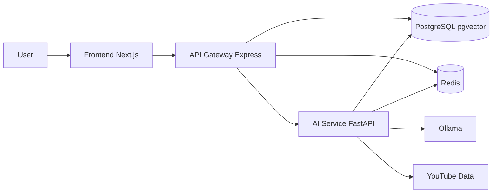

# AI 旅遊平台 MVP 計畫

## 目標與範圍

- 先做你指定的 `mvp_then_iterate`：可上線 MVP，並保留後續擴充點。
- 先更新 TODO 與新增啟動文件，再進入功能開發。
- 不儲存整部影片或完整字幕原文；僅儲存可檢索與可回放所需 metadata/片段資料。

## 先做文件（你要求的第一步）

- 更新 [C:/Users/Administrator/Desktop/AIYO/docs/myTODO.md](C:/Users/Administrator/Desktop/AIYO/docs/myTODO.md)
  - 新增「登入與帳號系統」、「主畫面」、「個人化記憶」、「影片推薦與播放器」、「效能與快取」子項目。
  - 將既有項目對應到新流程（session_id 過渡到 user_id）。
- 新增啟動指南 [C:/Users/Administrator/Desktop/AIYO/docs/服務啟動指南.md](C:/Users/Administrator/Desktop/AIYO/docs/服務啟動指南.md)
  - 一鍵啟動順序（Postgres/Redis/Ollama -> ai-service -> api-gateway -> frontend）。
  - 每個服務的安裝、啟動指令、健康檢查 URL、常見錯誤排查。
  - 本機開發與 `.env.example` 欄位說明（不改 `.env` 內容）。

## 架構與資料流（MVP）

## 功能實作路線

### A. 登入與主畫面（Email/密碼 + JWT）

- 後端（gateway）
  - 新增使用者與認證 API：`/api/auth/register`、`/api/auth/login`、`/api/auth/me`、`/api/auth/logout`。
  - 加入 JWT middleware，保護 chat/history/itinerary/personalization 路由。
  - 檔案：
    - [C:/Users/Administrator/Desktop/AIYO/api-gateway/src/index.js](C:/Users/Administrator/Desktop/AIYO/api-gateway/src/index.js)
    - 新增 [C:/Users/Administrator/Desktop/AIYO/api-gateway/src/auth.js](C:/Users/Administrator/Desktop/AIYO/api-gateway/src/auth.js)
- 前端
  - 新增路由：`/login`、`/`（主畫面）、`/planner`（既有規劃頁）
  - 導入 token 儲存與登入守衛（未登入導向 `/login`）。
  - 檔案：
    - 新增 [C:/Users/Administrator/Desktop/AIYO/frontend/app/login/page.tsx](C:/Users/Administrator/Desktop/AIYO/frontend/app/login/page.tsx)
    - 新增 [C:/Users/Administrator/Desktop/AIYO/frontend/app/(app)/page.tsx](C:/Users/Administrator/Desktop/AIYO/frontend/app/(app)/page.tsx)
    - 調整 [C:/Users/Administrator/Desktop/AIYO/frontend/app/page.tsx](C:/Users/Administrator/Desktop/AIYO/frontend/app/page.tsx) 為受保護頁

### B. 個人化記憶（skill-like）

- 核心想法：每位使用者有「偏好檔（Profile Skill）」+「行為摘要（Memory Facts）」。
- 啟動新對話/新行程前，先讀 profile 與 memory，組成 system context 給 LLM。
- 後端（ai-service + gateway）
  - `ai-service` 新增 context 組裝函式：`build_user_profile_context(user_id)`
  - `gateway` 新增個人化 API：`GET/PUT /api/user/profile`、`GET /api/user/memory`
  - 檔案：
    - [C:/Users/Administrator/Desktop/AIYO/ai-service/app/main.py](C:/Users/Administrator/Desktop/AIYO/ai-service/app/main.py)
    - [C:/Users/Administrator/Desktop/AIYO/api-gateway/src/index.js](C:/Users/Administrator/Desktop/AIYO/api-gateway/src/index.js)

### C. AI 對話中的影片推薦（5 支）+ 小型播放器

- `ai-service` 在 chat 回傳中附 `recommended_videos`（最多 5 筆）：縮圖、標題、摘要、segments(時間戳)。
- 前端在聊天訊息下方渲染推薦卡；點擊開啟小型播放器 Modal；點擊時間戳可 seek 到該秒數。
- 檔案：
  - [C:/Users/Administrator/Desktop/AIYO/frontend/app/page.tsx](C:/Users/Administrator/Desktop/AIYO/frontend/app/page.tsx)
  - [C:/Users/Administrator/Desktop/AIYO/ai-service/app/main.py](C:/Users/Administrator/Desktop/AIYO/ai-service/app/main.py)

### D. 效能與避免重複處理（不存影片內容）

- 查詢優化
  - 先查 `videos + segments + segment_places` 已存在資料。
  - 若命中則直接回傳，不重跑 transcript/embedding/分段。
- 快取策略
  - Redis 快取熱門 query（短 TTL）+ user personalization context（短 TTL）。
- 任務去重
  - 以 `youtube_id` + `content_hash/version` 防止重複索引。

## 建議資料儲存設計（供你確認，符合不存整部影片）

- 必存（與帳號與個人化）
  - `users`：id、email、password_hash、created_at、last_login_at
  - `user_profiles`：user_id、travel_style、budget_pref、pace_pref、dietary_pref、transport_pref、updated_at
  - `user_memories`：user_id、memory_type、memory_text、confidence、source、created_at
- 必存（對話與行程）
  - `chat_sessions`：id、user_id、title、created_at
  - `chat_messages`：session_id、role、content、meta_json、created_at
  - `itineraries` 系列改掛 `user_id`（保留 session_id 作相容過渡）
- 必存（影片推薦）
  - `videos`：youtube_id、title、channel、duration、thumbnail_url、city、stats
  - `segments`：video_id、start_sec、end_sec、summary、tags、embedding
  - `segment_places` / `places`
- 不儲存
  - 整部影片檔案
  - 完整字幕原文（僅處理過程暫存）

## Migration 與相容策略

- 新增 migration：
  - `004_auth_and_users.sql`（users/user_profiles/user_memories/chat_sessions/chat_messages）
  - `005_link_user_to_itinerary.sql`（itineraries.user_id + 索引）
- `api-gateway` 先相容舊 `session_id`，新資料一律以 `user_id` 為主。

## 驗收檢查（MVP）

- 可註冊/登入/登出；未登入不可進入規劃頁。
- 新對話前能讀到使用者偏好並反映在回答。
- 每次聊天可回傳最多 5 支影片推薦，含縮圖與可跳轉時間戳。
- 已處理影片可直接從 DB 命中，避免重複處理。
- WebSocket 事件可在前端收到 `stream_response` 與 `itinerary_update`。

