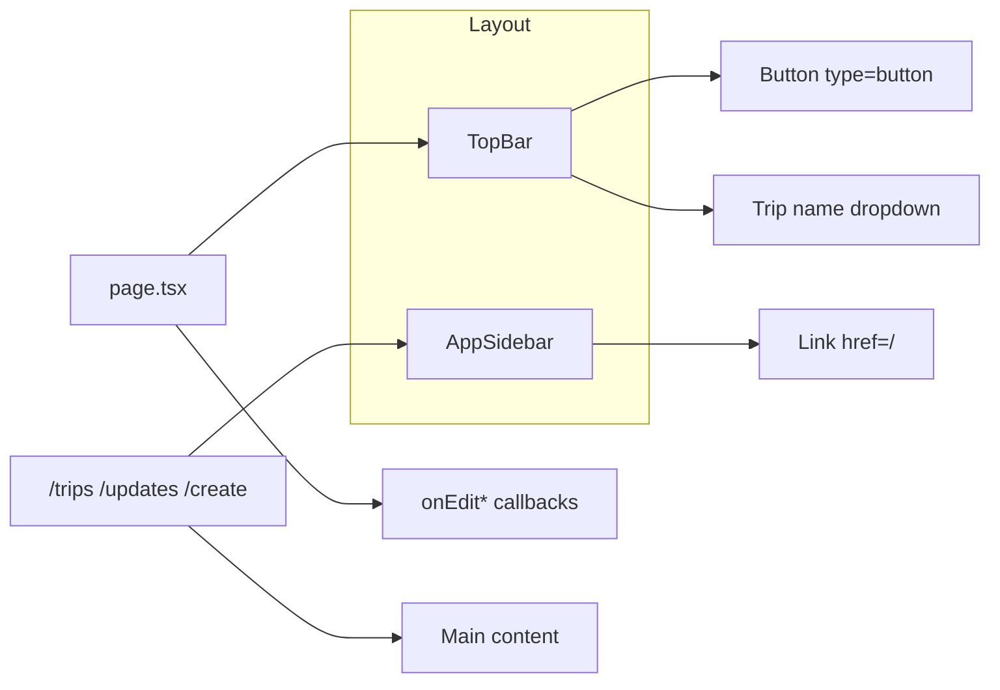

# 修復按鈕、下拉選單與完成 trips/updates/create 頁面

## 問題整理

| 項目                      | 位置                                                                                                 | 現況                                                                                |
| ----------------------- | -------------------------------------------------------------------------------------------------- | --------------------------------------------------------------------------------- |
| 按鈕樣式/功能                 | [TopBar.tsx](frontend/components/layout/TopBar.tsx) 使用 [Button](frontend/components/ui/button.tsx) | 需確認是否為樣式或 type 導致表單送出等問題                                                          |
| 行程名稱下拉選單                | TopBar 第 46–48 行                                                                                   | 僅為按鈕，無 onClick、無下拉選單                                                              |
| 側欄 Logo 返回首頁            | [AppSidebar.tsx](frontend/components/layout/AppSidebar.tsx) 第 71–74 行                              | 為 `
`，點擊無法導向首頁                                                                |
| TopBar 編輯按鈕             | TopBar Where/When/Who/Budget                                                                       | [page.tsx](frontend/app/page.tsx) 未傳入 onEditDestination 等四個 props，點擊會呼叫 undefined |
| /trips、/updates、/create | app 路由                                                                                             | 無對應 `page.tsx`，點側欄會 404                                                           |

---

## 1. 按鈕修復（Button / TopBar）

- **Button 元件**：[button.tsx](frontend/components/ui/button.tsx) 的 `buttonVariants` 已包含 `rounded-btn`，[tailwind.config.ts](frontend/tailwind.config.ts) 有 `borderRadius.btn: "999px"`，樣式應有效。若仍有問題，可檢查是否被其他 CSS 覆蓋或需加上 `type="button"` 避免在表單內誤觸 submit。
- **TopBar 內按鈕**：為「Invite」「Create a trip」加上明確 `type="button"`，並確認 `onInvite` / `onCreateTrip` 在 [page.tsx 約 2539–2541 行](frontend/app/page.tsx) 已正確綁定（目前已有），確保點擊不會觸發表單送出並可正常執行。

---

## 2. 行程名稱下拉選單（TopBar）

- **現況**：顯示 `tripName` + `ChevronDown` 的按鈕沒有 `onClick`，也沒有下拉內容。
- **做法**：
  - 在 TopBar 內用 `useState` 管理下拉開關（例如 `tripMenuOpen`）。
  - 按鈕 `onClick` 切換 `tripMenuOpen`；可選用 `useRef` + `useEffect` 點擊外部關閉。
  - 下拉內容可為：目前行程名稱、「在新分頁開啟」「複製連結」等（依現有 `onInvite` 等能力串接），或先做「切換行程」列表（從父層傳入 `savedItineraries` 與 `onSelectTrip` 等）。
  - 使用既有樣式（如 `border border-border bg-surface rounded-btn`）做出下拉區塊，避免與現有「inline-flex...」按鈕樣式衝突。

---

## 3. 側欄 Logo 點擊返回主畫面

- **檔案**：[AppSidebar.tsx](frontend/components/layout/AppSidebar.tsx)
- **修改**：將第 71–74 行的 `
` 改為用 Next.js `<Link href="/">` 包住同一區塊，保留內部 `Sparkles` 圖示與「AIYO.」文字，並加上 `cursor-pointer` 等 hover 樣式，使點擊導向首頁 `/`。

---

## 4. TopBar 編輯按鈕（Where / When / Who / Budget）

- **問題**：TopBar 的 `onEditDestination`、`onEditDates`、`onEditTravelers`、`onEditBudget` 在 [page.tsx](frontend/app/page.tsx) 未傳入，點擊會報錯或無反應。
- **做法**（二選一或分階段）：
  - **方案 A**：在 page.tsx 傳入四個回調；若暫無編輯 UI，可先傳 `() => {}` 或 `() => setSomeModalOpen(true)`，避免 undefined 呼叫。
  - **方案 B**：在 TopBar 內對未傳入的 handler 做防呆：`onClick={onEditDestination ?? undefined}` 且當 `!onEditDestination` 時改為 `disabled` 或改為純顯示。
- 建議：在 page.tsx 先傳入四個 no-op（例如 `() => {}`），之後再接上編輯 Modal 或內聯表單。

---

## 5. 新增 /trips、/updates、/create 頁面

三頁皆為「use client」、沿用與 [explore](frontend/app/explore/page.tsx)、[saved](frontend/app/saved/page.tsx) 相同的版面：左側 `<AppSidebar />`，右側 `<main>`。

- `**app/trips/page.tsx**`
  - 標題例如「Trips」、簡短說明。
  - 呼叫既有 API（如 `GET /api/itinerary`，與 saved 相同）取得行程列表。
  - 列表展示：標題、天數、狀態、最後更新等；點擊一筆可導向首頁並帶 query（例如 `?itineraryId=xxx`）或導向未來規劃的行程詳情頁。
  - 無資料時顯示空狀態（與 saved 類似）。
- `**app/updates/page.tsx**`
  - 標題例如「Updates」、簡短說明（例如行程/協作更新）。
  - 若後端尚無 updates API，先做靜態空狀態（「No updates yet」）或假資料列表，版面預留之後接 API。
- `**app/create/page.tsx**`
  - 標題例如「Create a trip」。
  - 可為「建立新行程」表單（標題、目的地、日期等），送出後呼叫 `POST /api/itinerary` 並導向首頁或 `/trips`；或簡化為一個 CTA 按鈕「Start planning」連結到 `/?new=1`，由首頁處理新行程邏輯。

依現有 [lib/api.ts](frontend/lib/api.ts) 的 `apiFetchWithAuth`、`getAccessToken` 與既有 itinerary API 使用方式，保持登入檢查（未登入可導向 `/login`）。

---

## 建議實作順序

1. **AppSidebar**：Logo 包成 `<Link href="/">`。
2. **TopBar**：
  - 為 Invite / Create a trip 加 `type="button"`；  
  - 行程名稱按鈕加上下拉狀態與下拉選單內容。
3. **page.tsx**：對 TopBar 傳入 `onEditDestination`、`onEditDates`、`onEditTravelers`、`onEditBudget`（可先 no-op）。
4. **Button**：若實際仍會觸發表單，在預設或 TopBar 使用處加上 `type="button"`。
5. 新增 **app/trips/page.tsx**、**app/updates/page.tsx**、**app/create/page.tsx**，並依上列內容實作。

---

## 架構關係（簡圖）

以上完成後，按鈕與下拉選單可正常運作、Logo 可返回主畫面、TopBar 編輯按鈕不會報錯，且三個路由皆有可用的介面。