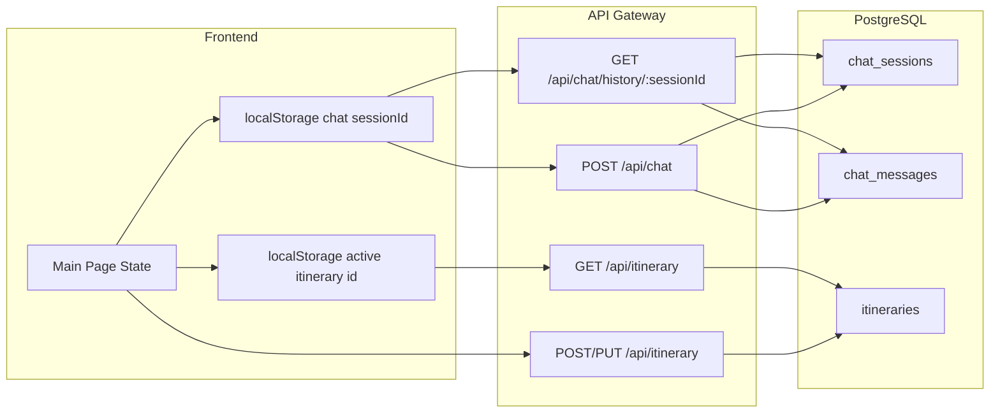

# 前端資料正確儲存與重整後保留

## 現況摘要

- **後端**：聊天與行程皆已寫入 PostgreSQL。
  - 聊天：`chat_sessions`（含 `external_session_id`）、`chat_messages`；GET `/api/chat/history/:sessionId` 從 DB 讀取。
  - 行程：`itineraries` / `itinerary_days` / `itinerary_slots`；CRUD 已實作於 [api-gateway/src/index.js](api-gateway/src/index.js)。
- **問題**：重整後資料「消失」的主因在前端：**(1) 聊天使用的 sessionId 在載入與送訊時不一致；(2) 目前編輯中的行程只存在 React state，未自動寫回或恢復。**

---

## 一、聊天紀錄（Chat）持久化

### 問題原因

- 主頁 [frontend/app/page.tsx](frontend/app/page.tsx) 中 `chatSessionId` 初始為 `createSessionId()`（隨機），之後在 auth 的 `useEffect` 裡被改成 `user-${data.user.id}-default`。
- 若使用者在 auth 完成前就送出一則訊息，該則會以「隨機 sessionId」寫入 DB；之後畫面切換成 `user-${id}-default`，再呼叫 GET history 時用的是後者，因此讀不到剛才那則（存在隨機 session 下）。
- 若未把「當前使用中的 sessionId」持久化，重整後也可能出現先以隨機 ID 發請求、再才切到 `user-id-default` 的時序，導致讀寫用的 session 不一致。

### 建議作法

1. **統一用「持久化 sessionId」**
  - 以 `localStorage` 儲存當前聊天 session（例如 key：`aiyo_chat_session_id`）。
  - 頁面載入時：若有 `aiyo_chat_session_id` 則用該值；否則不立即產生隨機 ID，等 `/api/auth/me` 回傳後再產生並寫入一個穩定 ID（例如 `user-${user.id}-default` 或新的 UUID），寫入 localStorage 並設為 `chatSessionId`。
  - 之後所有 POST /api/chat 與 GET /api/chat/history 都使用同一個 `chatSessionId`，避免「存用 A、讀用 B」。
2. **「New chat」行為**
  - 點擊 New chat 時：產生新的 sessionId（例如 `session-${crypto.randomUUID()}`），寫入 localStorage 並 `setChatSessionId`，清空畫面並可選擇是否呼叫 DELETE 舊 session（可選）。這樣重整後仍會載入「當前這則新對話」的歷史（因為 sessionId 已更新並持久化）。
3. **移除或調整會覆寫 sessionId 的邏輯**
  - 現有在 auth 成功後無條件 `setChatSessionId(\`user-${data.user.id}-default)` 的程式碼應改為：僅在「localStorage 尚無 aiyo_chat_session_id」時才設定預設值並寫入 localStorage，其餘情況以 localStorage 為準，避免覆蓋掉使用者正在用的 session。

依此實作後，聊天紀錄會一直用同一個 sessionId 讀寫，重整後會從 DB 正確載回該 session 的歷史。

---

## 二、行程（Itinerary）持久化與恢復

### 問題原因

- 行程的「目前編輯狀態」只存在 React state（`history`、`places` 等）；只有使用者手動按儲存才會呼叫 `saveItineraryToServer()`。
- 重整後 state 重置為 `createInitialState()`，若未從 URL 帶 `itineraryId`，就不會自動載入任何已儲存行程，使用者會看到空白。

### 建議作法

1. **記住「上次使用的行程」**
  - 將「當前編輯對應的 itinerary id」存到 localStorage（例如 `aiyo_active_itinerary_id`）。
  - 在成功儲存（POST 或 PUT 成功）後更新該 key；在 `loadSavedItinerary(id)` 成功後也更新。
2. **進入主頁時恢復**
  - 若 URL 已有 `?itineraryId=xxx`，維持現有邏輯：依該 id 呼叫 `loadSavedItinerary`。
  - 若 URL 沒有 `itineraryId`：讀取 `aiyo_active_itinerary_id`，若有且為有效數字，則自動呼叫 `loadSavedItinerary(parseInt(id))`，讓使用者回到上次編輯的行程。
3. **可選：自動儲存草稿**
  - 在行程內容變更時（例如 `state.days`、`places` 或 `history` 相關變更）以 debounce（例如 2–3 秒）呼叫 `saveItineraryToServer()`，可減少「忘了按儲存就重整」的資料遺失；實作時需注意避免與手動儲存重複送出、以及 `activeItineraryId` 與 payload 一致。

優先實作「記住上次行程 + 進入主頁恢復」即可明顯改善重整後行程消失的問題；自動儲存可列為第二階段。

---

## 三、資料流關係（概念）

---

## 四、實作要點（不更動 .env）

- 所有持久化僅使用前端既有機制（localStorage）與既有 API；不修改後端環境變數或 .env。
- 後端已正確寫入 DB，此計畫僅需調整前端：**一致使用持久化 sessionId**、**記住並恢復上次行程**，必要時再加上 debounce 自動儲存行程。

---

## 五、建議實作順序

| 步驟  | 項目                   | 說明                                                                    |
| --- | -------------------- | --------------------------------------------------------------------- |
| 1   | Chat sessionId 持久化   | 讀寫 localStorage、初始與 auth 後只補設預設值、New chat 時寫入新 ID。                    |
| 2   | Chat 不覆寫既有 session   | 調整 auth 的 useEffect，不再無條件覆寫為 user-id-default。                         |
| 3   | 行程「上次 id」持久化         | 儲存/載入成功時寫入 aiyo_active_itinerary_id。                                  |
| 4   | 主頁恢復上次行程             | URL 無 itineraryId 時，依 aiyo_active_itinerary_id 自動 loadSavedItinerary。 |
| 5   | （可選）行程 debounce 自動儲存 | 變更時 debounce 呼叫 saveItineraryToServer。                                |

完成後，用過的行程與聊天紀錄會正確存於資料庫，重整頁面時會依 localStorage 的 sessionId 與 itinerary id 從後端恢復，資料不會再消失。