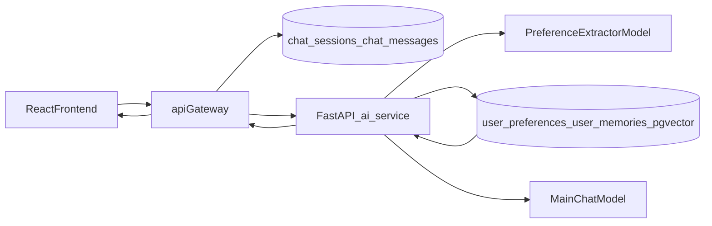

# 混合記憶架構實作計畫

## 目標

- 建立短期記憶（會話內 20-50 輪）與長期記憶（跨會話持久化）。
- 讓偏好抽取與記憶檢索由 FastAPI 主責，並在回覆前注入個人化記憶。
- 維持既有登入與聊天體驗，採漸進式改造，避免大幅破壞既有功能。

## 現況對齊與缺口

- 已有短期對話儲存：`[C:/Users/Administrator/Desktop/AIYO/api-gateway/src/index.js](C:/Users/Administrator/Desktop/AIYO/api-gateway/src/index.js)`（`chat_sessions` + `chat_messages`）。
- 已有長期記憶表與基礎抽取：`[C:/Users/Administrator/Desktop/AIYO/scripts/migrations/004_auth_and_users.sql](C:/Users/Administrator/Desktop/AIYO/scripts/migrations/004_auth_and_users.sql)` 與 `api-gateway` 抽取函式。
- 已有 FastAPI 記憶注入入口：`[C:/Users/Administrator/Desktop/AIYO/ai-service/app/main.py](C:/Users/Administrator/Desktop/AIYO/ai-service/app/main.py)`（`build_user_profile_context()`）。
- 缺口：尚未把「結構化偏好抽取 + embedding 寫入 + 語意檢索」完整落在 FastAPI；也缺少專用偏好向量表與查詢索引。

## 架構落地（混合模式）

## 分階段實作

### Phase 0：安全基線與隔離

- `api-gateway` 採 `access_token + refresh_token`，refresh 僅在 gateway 管理。
- `ai-service` 僅接受內部 token 或 IP 白名單來源，不直接信任前端 JWT。
- `ai-service` CORS 僅允許 gateway 來源。
- 長期偏好表啟用 RLS，Policy 以 `current_setting('app.user_id')` 做 `user_id` 隔離；每次查詢前 `SET LOCAL app.user_id`。

涉及檔案：

- `[C:/Users/Administrator/Desktop/AIYO/api-gateway/src/index.js](C:/Users/Administrator/Desktop/AIYO/api-gateway/src/index.js)`
- `[C:/Users/Administrator/Desktop/AIYO/ai-service/app/main.py](C:/Users/Administrator/Desktop/AIYO/ai-service/app/main.py)`
- `[C:/Users/Administrator/Desktop/AIYO/scripts/migrations/](C:/Users/Administrator/Desktop/AIYO/scripts/migrations/)`

### Phase 1：資料層補齊（長期偏好向量化）

- 新增 migration：建立 `user_preferences`（或擴充現有 `user_profiles` 搭配 `preferences_json + embedding_vector + updated_at`）。
- 新增/確認 pgvector 索引（優先 `HNSW`，建議 `m=16`、`ef_construction=64`）與常用查詢索引（`user_id, updated_at`）。
- 若採最小風險，先保留 `user_memories`，新增 `user_preferences` 作為「結構化偏好主表」。

涉及檔案：

- `[C:/Users/Administrator/Desktop/AIYO/scripts/migrations/](C:/Users/Administrator/Desktop/AIYO/scripts/migrations/)`
- `[C:/Users/Administrator/Desktop/AIYO/scripts/init-db.sql](C:/Users/Administrator/Desktop/AIYO/scripts/init-db.sql)`

### Phase 2：FastAPI 偏好抽取與寫入

- 在 `ai-service` 新增偏好抽取函式：輸入最近 N 輪對話，輸出固定 JSON schema（budget、travel_likes、video_likes、pace、transport、constraints）。
- 加入抽取觸發策略：每 3 輪或會話結束觸發一次，避免每輪都抽造成負載。
- 抽取 prompt 明確限制「僅旅遊相關偏好、忽略敏感詞」，並使用 `format='json'` + schema 驗證降低幻覺。
- 以 embedding 模型（現有 Ollama embed）將偏好 JSON 向量化後寫入 `user_preferences`。
- embedding 寫入採批次化（例如每 10 筆對話一批）以減少 I/O 與模型呼叫頻率。
- 失敗時降級：抽取失敗不阻斷主聊天流程。

涉及檔案：

- `[C:/Users/Administrator/Desktop/AIYO/ai-service/app/main.py](C:/Users/Administrator/Desktop/AIYO/ai-service/app/main.py)`

### Phase 3：FastAPI 長期記憶檢索與 Prompt 注入

- 新增 `retrieve_memory(query, user_id)`：對 `user_preferences` + 近期待用 `user_memories` 做混合檢索（語意相似 + 最近更新）。
- 檢索策略：`LIMIT 3-5`，相似度 threshold（預設 > 0.8，可配置）。
- 在主 `/api/chat` 組 prompt 時注入：
  - 近期短期記憶摘要（由 gateway 傳入 messages）
  - 長期偏好摘要（budget/likes/video_prefs/constraints）
- 設定注入上限與排序規則（防止 prompt 過長、衝突記憶覆寫）。
- Ollama 參數基線：`keep_alive=5m`、`num_predict=2048`，抽取模型優先可用較快模型（如 qwen2.5 系列）。

涉及檔案：

- `[C:/Users/Administrator/Desktop/AIYO/ai-service/app/main.py](C:/Users/Administrator/Desktop/AIYO/ai-service/app/main.py)`

### Phase 4：Gateway 對接與責任收斂

- `api-gateway` 保留：
  - 認證、session、短期對話寫入
  - 對 `ai-service /api/chat` 的代理
- `api-gateway` 增加 Redis 短期快取：`chat:session:{session_id}`，TTL=1h，並固定保留最近 50 則訊息避免 token 膨脹。
- `api-gateway` 移除或弱化重複的長期記憶抽取邏輯（避免雙寫衝突），改為可選 fallback。
- 在 `/api/chat` request 中明確傳遞 `user_id + session_id + trimmed messages` 供 FastAPI 決策。

涉及檔案：

- `[C:/Users/Administrator/Desktop/AIYO/api-gateway/src/index.js](C:/Users/Administrator/Desktop/AIYO/api-gateway/src/index.js)`

### Phase 5：前端控制與可觀測性

- 前端保留現有「AI 檢查偏好」手動入口；新增「自動抽取開關」可選設定。
- 聊天後刷新記憶摘要（非阻塞）。
- 顯示來源與時間（manual / chat_auto / chat_ai_review）。
- 當系統進入 fallback（僅短期記憶）時，在 UI 給出輕量提示但不中斷聊天。

涉及檔案：

- `[C:/Users/Administrator/Desktop/AIYO/frontend/app/page.tsx](C:/Users/Administrator/Desktop/AIYO/frontend/app/page.tsx)`

### Phase 6：監控與壓測

- 建立 Sentry（gateway + ai-service）錯誤追蹤與關鍵 breadcrumbs。
- 建立 Prometheus 指標：E2E latency、gateway p95、ai-service latency、Ollama latency、DB query latency、fallback 次數。
- 告警規則：gateway p95 > 500ms 持續 N 分鐘觸發。
- 以 Locust 模擬 10 位使用者併發，驗證目標 E2E < 2s。

涉及檔案：

- `[C:/Users/Administrator/Desktop/AIYO/api-gateway/](C:/Users/Administrator/Desktop/AIYO/api-gateway/)`
- `[C:/Users/Administrator/Desktop/AIYO/ai-service/](C:/Users/Administrator/Desktop/AIYO/ai-service/)`
- `[C:/Users/Administrator/Desktop/AIYO/docs/](C:/Users/Administrator/Desktop/AIYO/docs/)`

### Phase 7：驗證與回歸

- 單元測試：偏好 JSON schema 驗證、抽取失敗降級、重複記憶去重。
- 整合測試：
  - 連續 5 輪對話是否正確沉澱偏好
  - 新會話是否讀到舊偏好
  - 旅遊推薦是否明確反映預算/喜好/影片偏好
- 效能驗證：記憶檢索 p95、聊天延遲增量、DB 索引命中。

涉及檔案：

- `[C:/Users/Administrator/Desktop/AIYO/docs/](C:/Users/Administrator/Desktop/AIYO/docs/)`（新增驗收紀錄）

## 驗收標準

- 使用者在 A 會話提到「預算 3 萬、偏好美食 vlog」，B 會話詢問東京行程時，回覆能反映該偏好。
- 長期偏好至少包含：`budget`, `travel_likes`, `video_likes`，且可追蹤更新時間。
- 抽取失敗不影響主回覆；系統可正常退回僅短期記憶模式。
- 記憶注入後回覆品質提升，且不出現明顯錯誤身分詞（如「誰」）。
- 無法由前端直接存取 ai-service 敏感端點（內部驗證與 CORS 限縮生效）。
- RLS 生效，跨使用者記憶查詢無法讀取他人資料。
- Redis 快取與索引優化後，壓測可達 E2E < 2s 目標。

